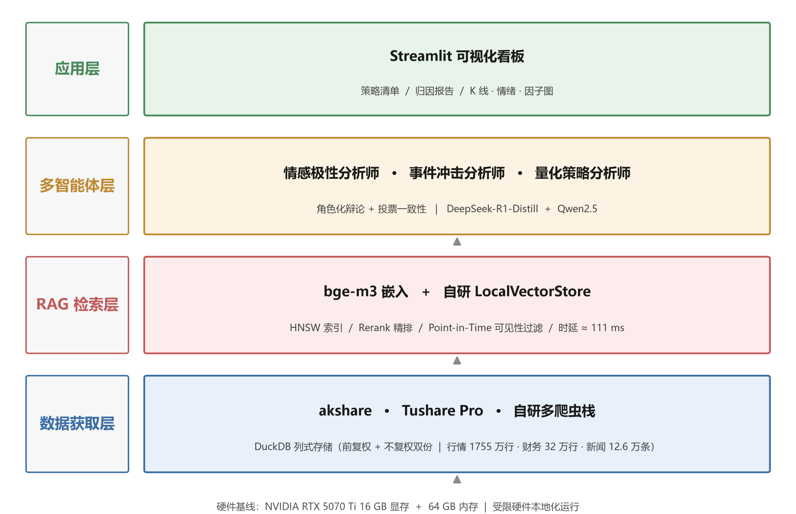
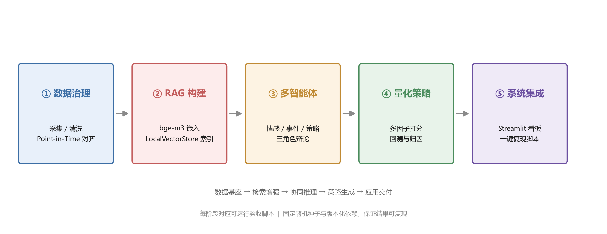

<div align="center">

# A 股多智能体舆情分析与量化策略系统

**基于大语言模型多智能体的 A 股舆情分析与量化策略系统设计与实现**

[](https://www.python.org/)
[](https://pytorch.org/)
[](https://duckdb.org/)
[](https://www.modelscope.cn/)
[](https://huggingface.co/BAAI/bge-m3)
[](https://www.nvidia.com/)
[](https://github.com/yellowanchor/a-share-agent-system)

</div>

---

## 项目简介

本系统面向 A 股市场，构建「数据采集 → 情感分析 → 检索增强 → 多智能体决策」的完整技术链路：以 1755 万行行情数据与 12.6 万条金融新闻为数据基座，通过弱监督打标与 QLoRA 微调训练金融领域情感分析模型（准确率 89.0%），并以自研向量库提供毫秒级证据检索，最终由分析师 / 策略师 / 评审员三类智能体协作生成可追溯的投资分析报告。

> 本科毕业设计项目 · 2026 届 · 数据科学与大数据技术

## 目录

- [核心特性](#核心特性)
- [系统架构](#系统架构)
- [快速开始](#快速开始)
- [项目结构](#项目结构)
- [实验结果](#实验结果)
- [技术栈](#技术栈)
- [开发路线](#开发路线)
- [免责声明](#免责声明)

## 核心特性

| 特性 | 说明 |
|------|------|
| **真实数据基座** | 全 A 股行情 1755 万行（5443 只，含退市 232 只，1990–2026）、财务报表 32 万行、金融新闻 12.6 万条，全部来自公开渠道，无任何模拟数据 |
| **Point-in-Time 对齐** | 财务数据按 `pubDate`（实际披露日）对齐，杜绝未来函数，保证回测有效性；行情同时保存前复权与不复权双份 |
| **自研向量库 LocalVectorStore** | 替代 ChromaDB，规避其在 Windows 下 HNSW 索引不落盘的缺陷；bge-m3 + GPU 精确余弦检索，端到端 111ms，支持 md5 幂等的增量更新 |
| **弱监督 + QLoRA 情感分析** | 金融情感词典（人工一致率 90.5%）自动打标 12.6 万条，再以 QLoRA NF4 微调 Qwen2.5-7B，准确率 89.0%，利空类召回率 100% |
| **16GB 显存工程方案** | 尾部 logits 切片 + 左填充，解决 Windows WDDM 显存换页问题，单卡完成 7B 模型 3 epoch 训练 |

## 系统架构

<div align="center">
  
</div>

<details>
<summary>架构分层说明</summary>

- **数据层**：`data_platform` 负责采集（AkShare / BaoStock / 新浪财经 / 腾讯行情），产出 parquet 后由 DuckDB 统一建库；
- **存储层**：DuckDB 列式分析库（3555 万行，建库 27s）+ LocalVectorStore 向量索引（12.6 万条 × 1024 维）；
- **模型层**：bge-m3 嵌入模型 + Qwen2.5-7B-Instruct（QLoRA 微调）情感分类器；
- **智能体层**：Analyst（检索证据生成初稿）/ Strategist（策略建议）/ Critic（事实校验）；
- **应用层**：Streamlit 交互式看板。

</details>

### 工作流程

<div align="center">
  
</div>

## 快速开始

### 1. 环境准备

```bash
git clone https://github.com/yellowanchor/a-share-agent-system.git
cd a-share-agent-system/a_share_agent_system

pip install -r requirements.txt

# PyTorch（CUDA 12.8）需单独安装
pip install torch --index-url https://download.pytorch.org/whl/cu128
```

模型权重需自行下载并放入 `models/` 目录（该目录已加入 `.gitignore`）：

| 模型 | 来源 |
|------|------|
| `BAAI/bge-m3` | Hugging Face / ModelScope |
| `Qwen/Qwen2.5-7B-Instruct` | ModelScope |

### 2. 数据底座构建

```bash
# 构建 DuckDB 行情库（1755 万行，约 27s）
python scripts/build_market_db.py

# 构建向量检索索引（12.6 万条新闻）
python scripts/build_rag_index.py

# 端到端验证（8 项验收）
python scripts/validate_rag.py
```

### 3. 情感分析（Phase 2）

```bash
# 弱监督词典打标（12.6 万条，7.9 秒）
python scripts/build_sentiment_dataset.py

# 构造 QLoRA 指令训练集（44,100 条，自动排除 Golden Set）
python scripts/build_sft_dataset.py

# 微调 Qwen2.5-7B（支持 --resume 断点续训）
python src/models/sentiment/train.py

# Golden Set 评估：base vs SFT
python src/models/sentiment/evaluate.py

# RAG 检索质量评估（Recall@5 / MRR@10）
python scripts/eval_rag_recall.py
```

## 项目结构

```
a-share-agent-system/
├── a_share_agent_system/          # 主系统
│   ├── src/
│   │   ├── agents/                # 多智能体框架（Analyst / Strategist / Critic）
│   │   ├── data/
│   │   │   ├── fetchers/          # 数据采集器（行情 / 新闻）
│   │   │   ├── storage/           # DuckDB 查询接口
│   │   │   └── validators/        # 数据质量校验
│   │   ├── models/
│   │   │   ├── rag/               # 自研向量库 LocalVectorStore（支持增量更新）
│   │   │   └── sentiment/         # 情感分析（词典打标 / QLoRA 训练 / 评估）
│   │   └── utils/                 # 日志与显存监控
│   ├── scripts/                   # 构建、评估、验证脚本
│   ├── docs/                      # 架构图与流程图
│   ├── configs/                   # 配置文件
│   └── tests/                     # 单元测试
├── data_platform/                 # 数据采集平台
│   ├── scripts/                   # 采集脚本（01–06）
│   └── src/                       # BaoStock 客户端与存储封装
└── README.md
```

> 数据与模型权重不纳入版本控制，详见 [`.gitignore`](.gitignore)。

## 实验结果

### 数据底座性能（Phase 1）

| 指标 | 数值 |
|------|------|
| DuckDB 入库（3555 万行） | 27 秒 |
| 行情区间查询 | 56 ms |
| 向量检索端到端（12.6 万条） | 111 ms |
| Phase 1 验收项 | 8 / 8 通过 |

### 情感分析对比（Phase 2，Golden Set 200 条人工标注）

| 模型配置 | Accuracy | Macro-F1 |
|----------|:--------:|:--------:|
| 词典（弱监督教师） | 0.905 | — |
| **SFT（QLoRA 3 epoch）** | **0.890** | **0.858** |
| SFT + RAG（检索增强） | 0.820 | 0.733 |
| base（Qwen2.5-7B 零样本） | 0.795 | 0.750 |

**SFT 分类别指标**

| 类别 | Precision | Recall | F1 |
|------|:---------:|:------:|:--:|
| 利好 | 0.953 | 0.878 | 0.914 |
| 利空 | 0.914 | **1.000** | 0.955 |
| 中性 | 0.667 | 0.750 | 0.706 |

**关键结论**

1. **SFT 微调有效**：较 base 提升 9.5 个百分点，利空类 53/53 全部命中，对风控场景最具价值。
2. **弱监督天花板效应**：SFT 误差与教师词典重合度达 94.7%，逼近但未超越 90.5%，符合弱监督学习理论预期；突破需引入更高质量标注源。
3. **RAG 对单条分类无增益（负结果）**：检索增强使准确率降至 82.0%，归因于训练/推理分布偏移与历史新闻的错误锚定。因此 RAG 的定位调整为**报告生成的证据引用**，而非分类器增益。

### RAG 检索质量

| 指标 | 数值 |
|------|------|
| Recall@5 | 0.842 |
| MRR@10 | 0.809 |
| 单次向量检索 | 3 ms |
| 首个相关结果落位 Top-1 | 78.6% |

## 技术栈

| 类别 | 技术 |
|------|------|
| 语言 | Python 3.12.3 |
| 数据存储 | DuckDB 1.5.3（列式，内存模式） |
| 向量检索 | 自研 LocalVectorStore（bge-m3 + torch GPU 精确余弦） |
| 嵌入模型 | BAAI/bge-m3（1024 维，560M 参数） |
| 大语言模型 | Qwen2.5-7B-Instruct（QLoRA NF4 + LoRA r=64） |
| 训练框架 | PyTorch 2.11.0+cu128 / PEFT / TRL / bitsandbytes |
| 数据源 | AkShare / BaoStock / 新浪财经 / 腾讯行情 |
| 前端 | Streamlit（Phase 3） |

## 开发路线

- [x] **Phase 1** — 数据底座：数据采集 + DuckDB 建库 + RAG 向量检索
- [x] **Phase 2** — 模型训练：弱监督打标 + QLoRA 微调 + 三组对比实验
- [ ] **Phase 3** — 多智能体框架（Analyst / Strategist / Critic）+ Streamlit 前端

## 硬件环境

| 项 | 配置 |
|----|------|
| GPU | NVIDIA RTX 5070 Ti 16GB |
| 内存 | 64GB |
| 操作系统 | Windows 11 |

## 免责声明

本项目为学术研究用途，所有结论不构成任何投资建议。数据来源为公开渠道（AkShare、BaoStock、新浪财经、腾讯行情等），模型输出存在不确定性，请勿直接用于实际投资决策。
